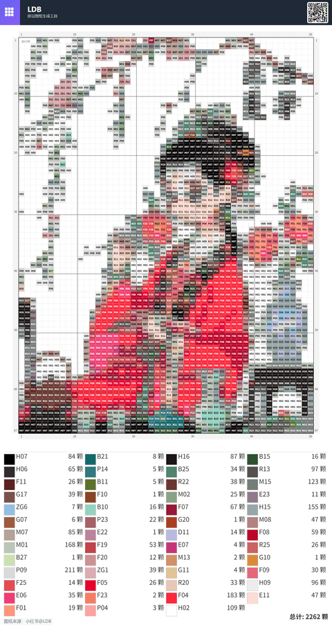
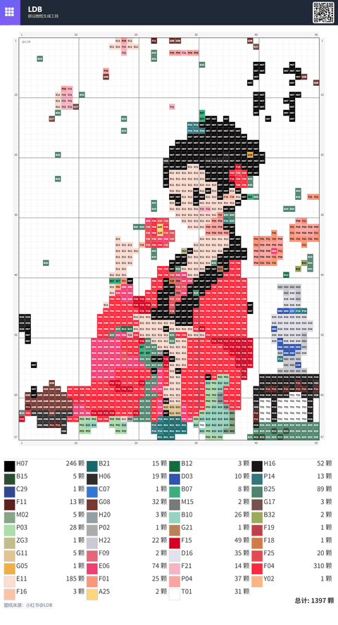
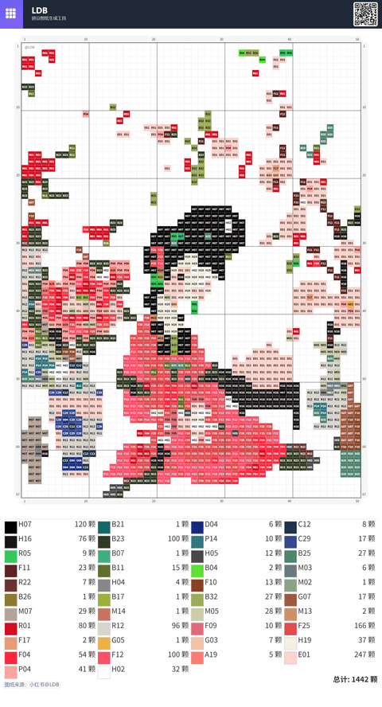
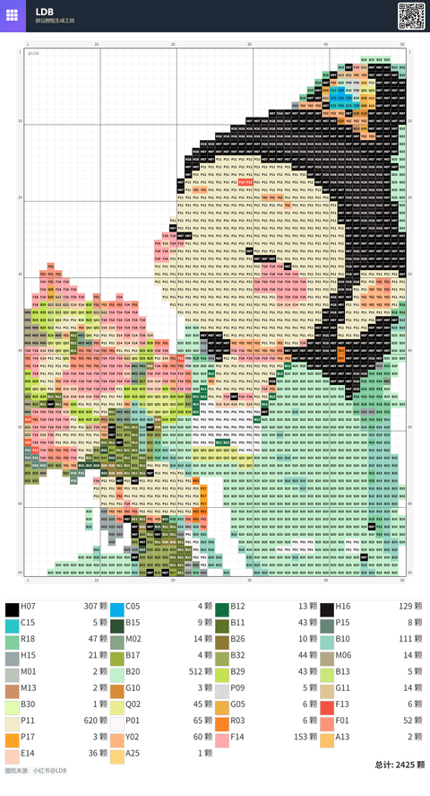
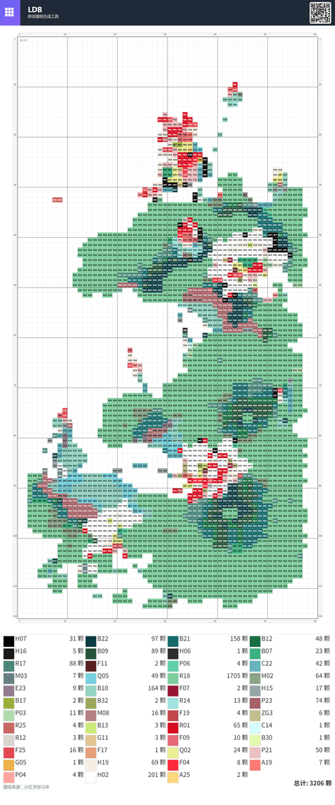
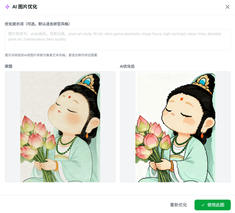

# 拼豆底稿生成器 (Perler Beads Generator)

基于开源项目：https://github.com/liangdabiao/perler-beads-ai

## 快速开始

本项目采用 **Next.js 静态导出 + Cloudflare Pages Function（编译为 Worker）** 架构：像素化、颜色映射等重计算全部在浏览器端完成，服务端只有一个轻量的 AI 代理接口，Cloudflare 免费额度完全够用——**完全免费、无需任何配置、部署完成即可用浏览器访问**（可用 Cloudflare 免费域名，也可绑定自己的域名）。

### 本地开发

```bash
git clone https://github.com/liangdabiao/perler-beads-ai.git
cd perler-beads-ai
npm install
npm run dev       # 打开 http://localhost:3000（Next.js 开发服务器，不含 AI 接口）
```

### 部署到 Cloudflare

```bash
npm run build     # 构建出 out/、out/_worker.js/ 与 out/.assetsignore
npm run deploy    # 部署到 Cloudflare（npx wrangler deploy）
# 如需本地预览完整环境（含 AI 接口）：npm run preview
```

不使用 AI 优化功能时，连服务端环境变量都不需要配置。

> 新版 Cloudflare 面板不再有「Build output directory」输入框：静态目录写在仓库的 `wrangler.jsonc` 里，面板的 Deploy command 用 `npx wrangler deploy`。

完整的部署步骤（从零注册 Cloudflare、Wrangler 命令行部署、连接 GitHub 自动部署、环境变量、Preview Deployment、自定义域名、常见问题）见 **[Cloudflare 部署指南](docs/部署/Cloudflare部署指南.md)**。

### 常用命令速查

| 命令 | 说明 |
|------|------|
| `npm run dev` | 本地开发（Next.js 开发服务器，**不含** AI 接口） |
| `npm run build` | `next build` + 编译 `functions/` 为 Worker + 生成 `out/.assetsignore` |
| `npm run preview` | 本地预览完整环境（`npm run build` + `wrangler dev`，含 AI 接口） |
| `npm run deploy` | 部署到 Cloudflare（需先 build） |
| `npx wrangler deploy --dry-run` | 只校验部署配置，不上传 |

## 部署到自己的服务器

本项目是纯静态导出（构建产物为 `out/`），任意静态主机都能托管；但 AI 优化接口 `/api/ai-optimize` 由 Cloudflare 上的 Pages Function（编译为 Worker）提供，在 Nginx/Apache 上并不存在，需要自行复刻，或者直接使用 Cloudflare。

详细步骤见 [自建服务器部署](docs/部署/自建服务器部署.md)。

即梦 免费api （智能绘图）申请地址： https://console.volcengine.com/ai/ability/detail/1

## 微信小程序

类似的功能，基于开源项目：https://github.com/liangdabiao/perlerBeadsApplet

## 文档导航

| 文档 | 说明 |
|------|------|
| [部署：Cloudflare](docs/部署/Cloudflare部署指南.md) | 推荐部署方式（静态导出 + Pages Function 编译为 Worker），含从零注册到 Preview Deployment 的完整步骤 |
| [部署：自建服务器](docs/部署/自建服务器部署.md) | 非 Cloudflare 环境的部署说明（Nginx / Docker / PM2 等） |
| [功能：一键去背景](docs/功能/一键去背景.md) | 一键去背景的实现原理、关键函数与调用链 |
| [参考：即梦 4.0 接口文档](docs/参考/即梦4.0接口文档.md) | 火山引擎即梦（Jimeng）图像生成接口原始文档存档 |
| [规划：双端云保存待办](docs/规划/双端云保存待办.md) | 网站端与小程序端共享作品数据的待办方案（当前未实现） |

## 展示案例

核心就是：ai 制作图纸，关键就是颜色尽可能少、颗粒尽可能少，各种图纸风格都兼容，同时表达尽可能清楚，这就是 AI 能够做到的。

<details>
<summary><b>📸 展开查看 7 张图纸实例</b>（缩略图，点击可查看原图）</summary>
<br>
<a href="docs/images/展示图-1.png"></a>
<a href="docs/images/展示图-2.png"></a>
<a href="docs/images/展示图-3.png"></a>
<a href="docs/images/展示图-4.png"></a>
<a href="docs/images/展示图-5.png"></a>
<a href="docs/images/展示图-6.png"></a>
<a href="docs/images/展示图-7.png"></a>
</details>

## ❓ 想解决的（市场上拼豆软件的）问题

以下是市场上拼豆软件普遍存在的问题，下面的「功能特点」逐条给出了本项目的做法：

1. 颜色识别不准确，
2. 灰色毛状边界线，
3. 无法自适应合并同色系的颜色，
4. 手动着色困难，无法精准选择颜色，
5. 无法给出采购清单，
6. 限制图片的导出和打印。

## 功能特点

*   **图片上传**: 支持拖放或点击选择 JPG/PNG 图片。
*   **智能像素化**:
    *   **可调粒度**: 通过滑块控制像素画的横向格子数量。
    *   **颜色合并**: 通过滑块调整相似颜色的合并阈值，平滑色块区域。
    *   **多种解析风格**: 支持不同的池化逻辑，适应不同类型的图片。
*   **多色板支持**:
    *   内置 MARD 完整色板（291 个色号），可通过"管理色板"逐色勾选/取消；默认排除 P、Q、R、T、Y、ZG 系列（默认选中 221 色）。
    *   **多种色号系统**: 支持 MARD、COCO、漫漫、盼盼、咪小窝等多种色号系统。
    *   **自定义调色板**: 允许用户创建和编辑自己的调色板，并支持导入/导出色板配置。
*   **颜色排除与管理**:
    *   在颜色统计列表中点击可**排除/恢复**特定颜色。
    *   排除颜色后，原使用该颜色的区域将智能重映射到邻近的可用颜色。
    *   提供一键恢复所有排除颜色的功能。
*   **实时预览**:
    *   即时显示处理后的像素画预览。
    *   **悬停/长按交互**: 在预览图上悬停（桌面）或长按（移动）可查看对应单元格的颜色编码 (Key) 和颜色。
    *   自动识别并标记外部背景区域（预览时显示为浅灰色）。
    *   **放大镜工具**: 支持局部放大查看细节。
*   **手动编辑工具**:
    *   **手动着色模式**: 允许用户直接在预览图上修改颜色。
    *   **橡皮擦功能**: 可以擦除不需要的颜色。
    *   **颜色替换功能**: 可以批量替换特定颜色。
*   **高级功能**:
    *   **图片裁剪**: 支持上传前裁剪图片。
    *   **一键去背景**: 自动识别边缘主色并用洪水填充去除外部背景（详见 [一键去背景](docs/功能/一键去背景.md)）。
    *   **AI优化**: 提供AI辅助优化功能，将普通图片转换为适合拼豆的像素风格。
    *   **悬浮调色盘和工具栏**: 方便用户操作。
    *   **专心拼豆模式**: 提供沉浸式拼豆体验。
*   **下载成品**:
    *   **带 Key 图纸**: 下载带有清晰颜色编码 (Key) 和网格线的 PNG 图纸，忽略外部背景。
    *   **颜色统计图**: 下载包含各颜色 Key、色块、所需数量的 PNG 统计图。
    *   **CSV格式导出**: 支持导出采购清单为 CSV 格式。
    *   **多种下载设置**: 可调整网格线、坐标、单元格编号等选项。

## 技术实现

*   **框架**: [Next.js](https://nextjs.org/) (React) 与 TypeScript
*   **样式**: [Tailwind CSS](https://tailwindcss.com/) 用于响应式布局和样式。
*   **核心逻辑**: 浏览器端 [Canvas API](https://developer.mozilla.org/en-US/docs/Web/API/Canvas_API) 用于图像处理、颜色分析和绘制。
*   **状态管理**: React Hooks (`useState`, `useRef`, `useEffect`, `useMemo`)。
*   **组件架构**: 模块化组件设计，包括：
    *   `PixelatedPreviewCanvas`: 像素化预览画布
    *   `CustomPaletteEditor`: 自定义调色板编辑器
    *   `FloatingColorPalette`: 悬浮调色盘
    *   `FloatingToolbar`: 悬浮工具栏
    *   `MagnifierTool`: 放大镜工具
    *   `ImageCropperModal`: 图片裁剪弹窗
    *   `AIOptimizeModal`: AI优化弹窗
    *   `DonationModal`: 打赏弹窗
*   **本地存储**: 使用 `localStorage` 存储用户的调色板选择和设置。
*   **颜色系统**: 支持多种色号系统的映射和转换。

### 核心算法：像素化、颜色映射与优化

应用程序的核心是将图像转换为像素网格，并将颜色精确映射到有限的拼豆调色板，同时进行平滑和背景处理。

1.  **图像加载与网格划分**:
    *   加载用户上传的图片。
    *   根据用户选择的"粒度"(`granularity`, N) 和原图宽高比确定 `N x M` 的网格尺寸。

2.  **初始颜色映射 (基于主导色)**:
    *   *为什么这样做*：早期做法是对单元内 RGB 取 **mean（均值）**，池化后图形边缘会出现**黑色毛边**；改为局部 **max pooling**（即取出现频率最高的 RGB 值）即可消除。
    *   遍历 `N x M` 网格。
    *   对每个单元格，在原图对应区域内找出出现频率最高的**像素 RGB 值 (Dominant Color)**（忽略透明/半透明像素）。
    *   使用**欧氏距离**在 RGB 空间中，将该主导色映射到**当前选定且未被排除**的调色板 (`activeBeadPalette`) 中最接近的颜色。
    *   记录每个单元格的初始映射色号和颜色 (`initialMappedData`)。

3.  **区域颜色合并 (基于相似度)**:
    *   *为什么这样做*：不做合并，同一色系内会残留大量**杂色**（这一步对应的就是"自动合并邻近相似颜色"）。
    *   使用**广度优先搜索 (BFS)** 遍历 `initialMappedData`。
    *   识别颜色相似（欧氏距离小于 `similarityThreshold`）的**连通区域**。
    *   找出每个区域内出现次数最多的**珠子色号**。
    *   将该区域内所有单元格统一设置为这个主导色号对应的颜色，得到初步平滑结果 (`mergedData`)。

4.  **背景移除 (基于边界填充)**:
    *   *为什么这样做*：不区分内外背景，**拼豆粒数统计会偏多**；统计图与带 Key 图纸只统计非"外部"的单元格。
    *   定义一组背景色号 (`BACKGROUND_COLOR_KEYS`, 如 T1, H1)。
    *   从 `mergedData` 的**所有边界单元格**开始，使用**洪水填充 (Flood Fill)** 算法。
    *   标记所有从边界开始、颜色属于 `BACKGROUND_COLOR_KEYS` 且相互连通的单元格为"外部背景" (`isExternal = true`)。

5.  **颜色排除与重映射**:
    *   这是"杂色自动去除后仍不干净"时的**附加功能**。
    *   当用户排除某个颜色 `key` 时：
        *   确定一个**重映射目标调色板**：包含网格中**最初存在**的、且**当前未被排除**的所有颜色。
        *   如果目标调色板为空（表示排除此颜色会导致没有有效颜色可用），则阻止排除。
        *   否则，将 `mappedPixelData` 中所有使用 `key` 的非外部单元格，重新映射到目标调色板中的**最近似**颜色。
    *   当用户恢复颜色时，触发完整的图像重新处理流程（步骤 1-4）。

6.  **生成预览图与下载文件**:
    *   **预览图**: 在 Canvas 上绘制 `mergedData`，根据 `isExternal` 状态区分内部颜色和外部背景（浅灰），并添加网格线。支持悬停/长按显示色号。
    *   **带 Key 图纸下载**: 创建临时 Canvas，绘制 `mergedData` 中非外部背景的单元格，填充颜色、绘制边框，并在中央标注颜色 Key。
    *   **统计图下载**: 统计 `mergedData` 中非外部背景单元格的各色号数量，生成包含色块、色号、数量的列表式 PNG 图片。

### 调色板数据

预设的拼豆调色板数据定义在 `src/app/colorSystemMapping.json` 文件中，该文件包含 291 种颜色的 hex 值到各个色号系统（MARD、COCO、漫漫、盼盼、咪小窝）的映射关系。用户实际可用的色板由"管理色板"中的逐色选择（`customPaletteSelections`，持久化在 `localStorage`）决定；默认选择逻辑见 `src/app/page.tsx` 的 `getDefaultPaletteSelections()`（排除 P/Q/R/T/Y/ZG 系列）。

## AI功能详解

### 功能原理

AI功能基于火山引擎的即梦AI (Jimeng AI) 模型，通过以下步骤实现图片优化：

1.  **图像预处理**: 将用户上传的图片压缩到合适尺寸（最大2048x2048），并转换为Base64格式。
2.  **AI模型调用**: 使用预定义或用户自定义的提示词 (Prompt) 调用AI模型，将图片转换为适合拼豆的风格。
3.  **结果处理**: 接收AI生成的图片，进行后处理并返回给用户。

### 核心技术

1.  **提示词工程**: 使用精心设计的默认提示词，确保生成的图片具有以下特点：
    - Chibi画风（可爱风格）
    - 白底背景
    - Pixel art风格（像素艺术）
    - 16位复古游戏美学
    - 清晰的焦点和高对比度
    - 干净的线条和详细的像素艺术

2.  **API集成**: 通过火山引擎的API进行AI模型调用，包括：
    - 任务提交 (`CVSync2AsyncSubmitTask`)
    - 任务状态查询 (`CVSync2AsyncGetResult`)
    - 签名生成和认证

3.  **异步处理**: 由于AI生成需要时间，采用轮询机制等待任务完成，最长等待时间约3分钟。

4.  **错误处理**: 完善的错误处理机制，包括：
    - 图片风险检测（确保内容安全）
    - API调用错误处理
    - 任务超时处理

### 使用流程

1.  **上传图片**: 用户上传需要优化的图片。
2.  **打开AI优化弹窗**: 点击AI优化按钮，打开优化设置弹窗。
3.  **配置参数**:
    - 可选择使用默认提示词或输入自定义提示词。
    - 点击"开始优化"按钮。
4.  **等待处理**: 系统显示处理进度，用户需要等待AI生成完成。
5.  **应用结果**: AI生成完成后，用户可以预览结果并选择是否应用到当前项目。

### 应用场景

1.  **风格转换**: 将普通照片转换为像素艺术风格，更适合拼豆制作。
2.  **简化复杂图像**: 自动简化复杂图像，突出主要元素，减少颜色数量。
3.  **背景处理**: 自动将复杂背景替换为白色，减少拼豆数量和复杂度。
4.  **创意增强**: 通过自定义提示词，用户可以尝试不同的艺术风格和效果。

### 相关文件

AI功能的实现涉及以下文件：

-   **前端实现**: `src/components/AIOptimizeModal.tsx` - AI优化弹窗组件
-   **核心工具**: `src/utils/aiOptimize.ts` - AI优化相关工具函数
-   **后端API**: `functions/api/ai-optimize.ts` - Cloudflare Pages Function，调用火山引擎API

> 火山引擎即梦接口的原始文档存档见 [参考：即梦 4.0 接口文档](docs/参考/即梦4.0接口文档.md)。

### 优势

1.  **智能化处理**: 利用AI技术自动处理图片，减少用户手动操作。
2.  **风格统一**: 生成的图片具有统一的像素艺术风格，更适合拼豆制作。
3.  **节省时间**: 快速将普通图片转换为适合拼豆的格式，节省用户设计时间。
4.  **灵活性**: 支持自定义提示词，满足用户的个性化需求。

### 注意事项

1.  **内容安全**: 系统会对图片进行风险检测，确保内容符合安全标准。
2.  **处理时间**: AI生成需要一定时间（通常1-2分钟），请耐心等待。
3.  **网络连接**: 需要稳定的网络连接以确保API调用成功。
4.  **API限制**: 基于火山引擎API的使用限制，可能存在调用频率限制。

## 许可证

Apache 2.0
